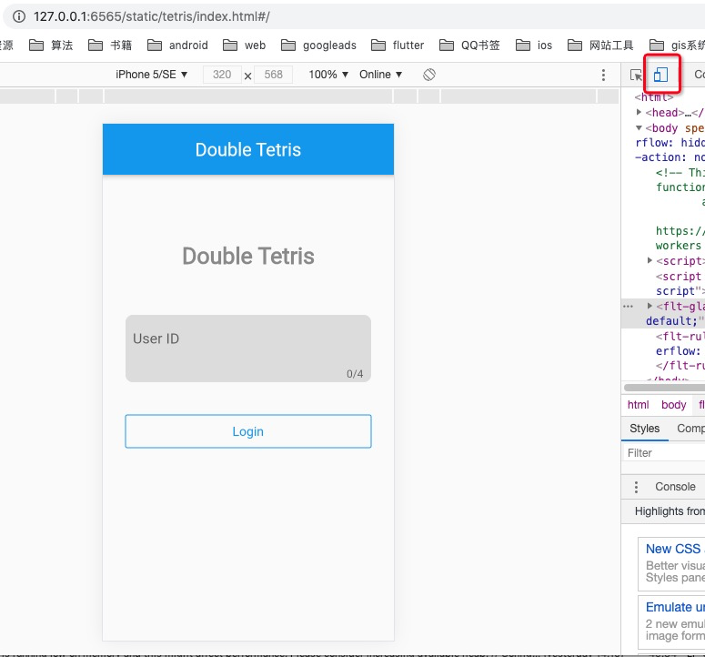

# joy-tetris-server
双人俄罗斯方块服务端

# 客户端

[双人俄罗斯方块客户端-flutter版](https://github.com/liangdas/joy-tetris-flutter)


# 快速部署docker版本服务端

1. 下载镜像
    
    docker pull 1587790525/joy-tetris:latest
    
2. 启动镜像

    docker run -p 0.0.0.0:6653:6653 -p 0.0.0.0:6563:6563 -p 0.0.0.0:6565:6565 --name joy-tetris 1587790525/joy-tetris
    
3. 服务日志如下

    ```starting nats-server
    starting consul
    sleep 3s
    [7] 2021/02/17 02:01:07.849858 [INF] Starting nats-server version 2.1.9
    [7] 2021/02/17 02:01:07.849982 [INF] Git commit [7c76626]
    [7] 2021/02/17 02:01:07.857285 [INF] Listening for client connections on 0.0.0.0:4222
    [7] 2021/02/17 02:01:07.857382 [INF] Server id is NAB4TH5FOSDVRPQ7IGYRRXOOHOXI7HAEXAULQYZGX25M2KRIIU7XXZEK
    [7] 2021/02/17 02:01:07.857410 [INF] Server is ready
    starting tetris-server
    http://127.0.0.1:6565/static/tetris/index.html#/
    [ not find tetris-server pid ]
    Server configuration path : /app/bin/conf/server.json
    。。。。
       ____    __
      / __/___/ /  ___
     / _// __/ _ \/ _ \
    /___/\__/_//_/\___/ v3.3.10-dev
    High performance, minimalist Go web framework
    https://echo.labstack.com
    ____________________________________O/_______
                                        O\
    ⇨ http server started on [::]:6565```
    
4. 启动web客户端

    [http://127.0.0.1:6565/static/tetris/index.html#/](http://127.0.0.1:6565/static/tetris/index.html#/)
    
> 建议使用移动设备调试模式   


> 双人经典模式


> 双人快速模式


5. macos客户端

[双人俄罗斯方块客户端-flutter版](https://github.com/liangdas/joy-tetris-flutter)

|-.....
|-joy_tetris_flutter_macos.zip (已编译好的macos执行文件)